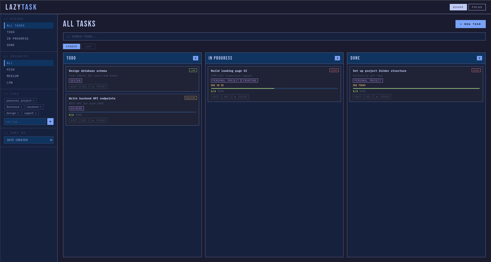
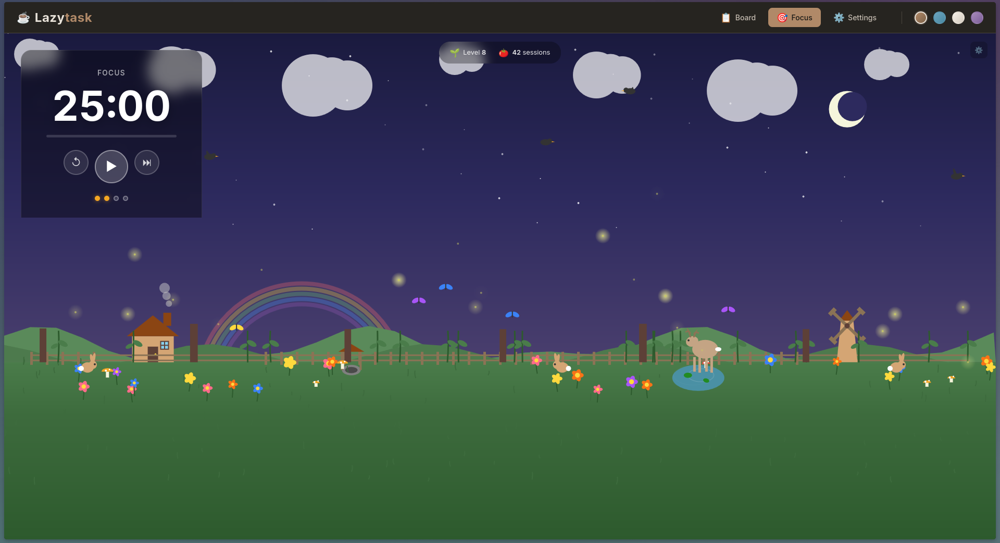

# 💤 LAZYTASK

## This is an vibe-coded todo site ✨  
## Its build around my need in an Todo App but since i don't really like the idea of downloading a seperate application i just vibe-coded one for me 😌  
## It contains a pomodoro timer 🍅 where you can link a specific task to the timer  
## It automatically creates a progressbar 📊 for task and subtask which comes in handy to quickly see the progress you have made.  

---

## 🖥️ Preview

---

## ⚡ Features

- 📝 Simple todo system  
- 🍅 Pomodoro timer linked with tasks  
- 📊 Auto progress tracking (tasks + subtasks)  
- 🎨 Multiple themes (Focus mode hits different)  

---

## 🧠 Why I built this

Didn’t want another bloated app.  
Didn’t want to download anything.  
So I just made one that does exactly what I need.  

---

## 🚀 Future ideas

- Better UI polish  
- More theme options  
- Maybe analytics (if I stop being lazy)
